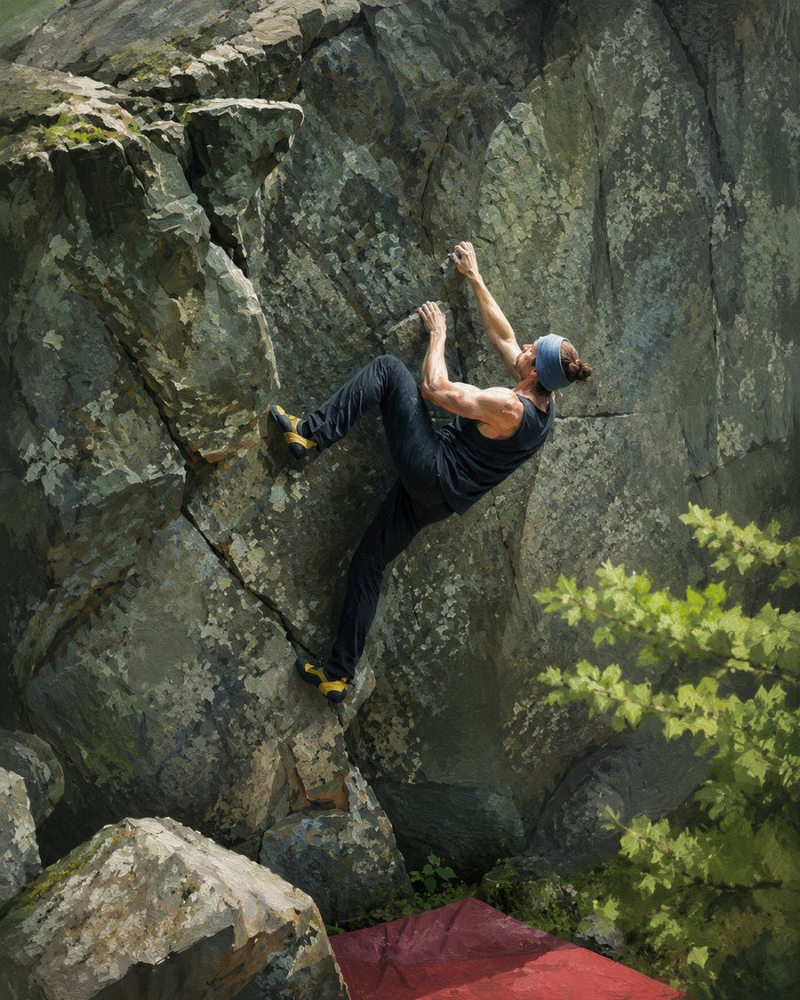
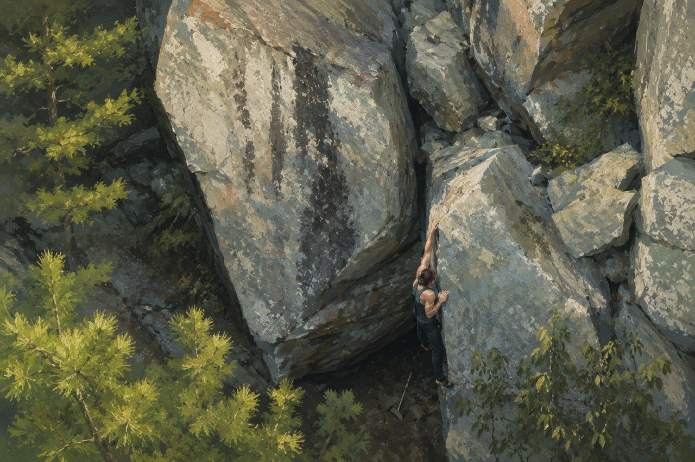

I teach mathematics and statistics at the **University of Arkansas at Little
Rock**, and I direct the **Math Assistance Center**. Mathematician,
statistician, teacher — most of what I do connects those three.

## What I work on

Most of my time goes to teaching and to building course materials that last. I
care about courses that explain why something works instead of just which
buttons to press, and I try to keep the materials public and reusable so they
still help after the semester ends. The two course sites here —
[Intro to Mathematical Software](/math-software/) and
[Intro to Statistics](/intro-stats/) — are part of that.

My research is in Bayesian statistics and evidence synthesis. I work on
bias-robust Bayesian meta-analysis: how to make sense of a body of studies when
publication bias, small-study effects, and selective reporting make the usual
summaries hard to trust. Much of that work is also about reproducibility. I use
R, Quarto, LaTeX, and Git as everyday tools, and I would rather an analysis be
something someone else can rerun than a result that only worked once.

## Outside work

::: {.about-split}

::: {.about-split-text}
I do a lot of bouldering. I also garden, take care of animals with my wife,
Jenn, and spend a fair amount of time building and fixing things — woodworking
and the steady stream of small projects that come with a house and a yard.

I like work that holds up: a problem climbed cleanly, a garden bed that keeps
producing, a repair I don't have to do twice. That carries over to the academic
side, though I won't pretend it all reduces to one tidy idea.
:::

::: {.about-split-img}
{fig-alt="Stylized painting of Matt Hester bouldering — pulling through a steep move on a gray rock face, with green foliage to one side and a crash pad below."}
:::

:::

{.about-wide-img fig-alt="Stylized painting of a bouldering area seen from above — a climber moving across large gray boulders surrounded by pine."}

If you want to get in touch, the [contact page](contact.qmd) has the best ways
to reach me.
