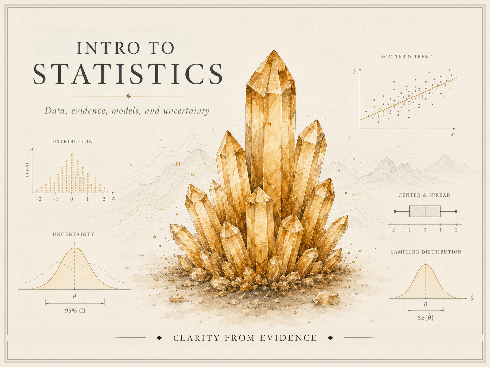

I teach mathematics and statistics at the **University of Arkansas at Little
Rock** and direct the **Math Assistance Center**. My teaching emphasizes
conceptual understanding, durable public course materials, reproducible work,
and the careful use of computational and AI tools.

## Current public course sites

Public, durable resource sites for two of my current courses. Roster- and
section-specific material lives in the LMS, not here.

::: {.course-hero-card-grid}

::: {.course-hero-card}
[{.course-hero-card-img fig-alt="Course identity hero for Intro to Mathematical Software — a blue-violet crystal cluster surrounded by mathematical software, workflow, simulation, and version-control graphics, with the course title."}](/math-software/)

::: {.course-hero-card-caption}
[**Intro to Mathematical Software**](/math-software/) — LaTeX, R, Quarto,
reproducible workflow, and careful AI-assisted work.
:::
:::

::: {.course-hero-card}
[{.course-hero-card-img fig-alt="Course identity hero for Intro to Statistics — an amber crystal cluster surrounded by introductory statistics graphics including distributions, uncertainty, scatterplots, center and spread, and sampling distributions, with the course title."}](/intro-stats/)

::: {.course-hero-card-caption}
[**Intro to Statistics**](/intro-stats/) — data, evidence, models,
uncertainty, and simulation.
:::
:::

:::

Each public course site also carries its own notes, labs, and examples
alongside curated resource collections — see the
[Math Software resources](/math-software/resources/) and the
[Intro Stats resources](/intro-stats/resources/).

## Assembled undergraduate course materials

Alongside the two course sites above, I have assembled full public
**course-material sites** for other undergraduate statistics and
probability courses. Each is a coherent, self-contained resource site —
synthesized notes, hands-on R/Quarto labs, and curated references —
built in the same style as the sites above.

These are **assembled course materials, not currently scheduled
sections.** Dates, weights, and final policies are not set here, and
anything operational for a live offering would live in the LMS. Treat
them as durable, public course resources rather than finished releases.

::: {.feature-grid}

::: {.feature-card .course-card}
### [Bayesian Statistics](/bayesian-statistics/)
Reasoning with uncertainty: priors, likelihoods, and posteriors;
Beta-Binomial and Bayesian regression models; simulation, model
checking, and introductory hierarchical ideas — with reproducible
R + Quarto labs.
:::

::: {.feature-card .course-card}
### [Introduction to Probability](/intro-probability/)
A first course in probability: sample spaces and rules, conditional
probability and Bayes' rule, random variables and the standard
distributions, and limit behavior — with Monte Carlo simulation labs.
:::

:::

## Teaching approach

- **Concepts before procedures.** Students should understand *why* a method
  works before reaching for it, so the procedure becomes a tool rather than a
  ritual.
- **Explain, verify, revise, communicate.** I ask students to justify their
  reasoning, check their results, revise their work, and communicate it
  clearly — the habits that outlast any single course.
- **Reproducible artifacts matter.** Rendered documents, organized projects,
  executable code, and transparent AI-use notes (when AI is used) make student
  work durable, checkable, and honest.

## Math Assistance Center

As **Director of the Math Assistance Center (MAC)** at UA Little Rock, I lead
the university's drop-in support center for lower-division mathematics and
statistics. The role is part academic service, part leadership:

- **Peer support at scale** — coordinating drop-in tutoring that meets students
  where they are, across many courses and sections.
- **Tutor mentoring and development** — hiring, training, and developing peer
  tutors so they grow as explainers, not just answer-checkers.
- **Instructional coordination** — aligning support with what courses actually
  ask of students, in conversation with the instructors who teach them.
- **Sustainable support workflows** — building durable, low-overhead systems so
  the center keeps running smoothly from term to term.
