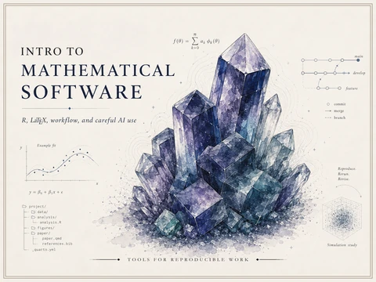
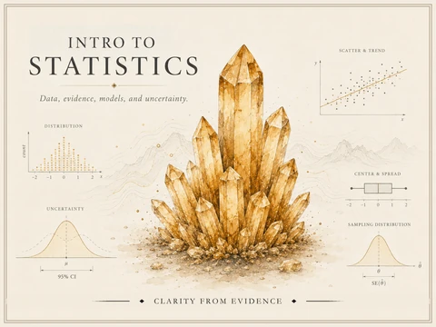
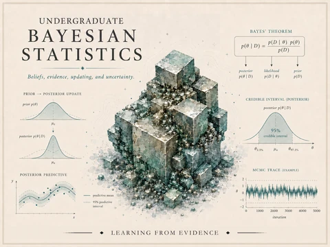
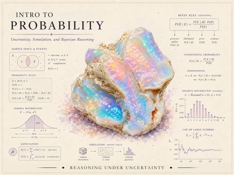
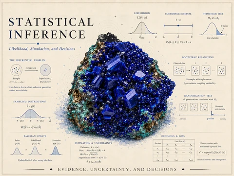
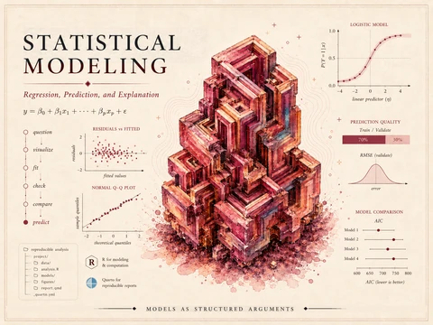
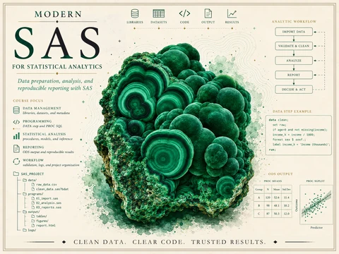
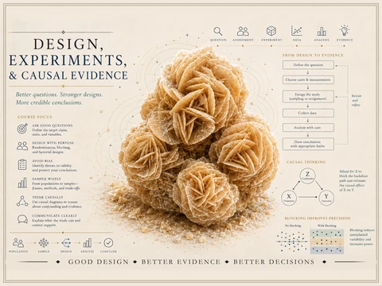
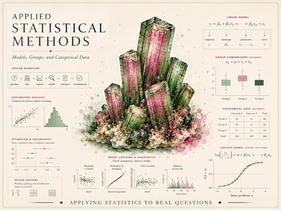
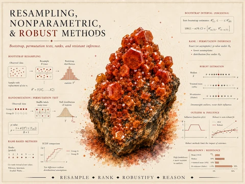

I teach mathematics and statistics at the **University of Arkansas at Little
Rock** and direct the **Math Assistance Center**. My teaching emphasizes
conceptual understanding, durable public course materials, reproducible work,
and the careful use of computational and AI tools.

This portfolio collects **ten public course-material sites** — two current
courses and eight assembled course-material sites — described below.

## Current public course sites

Public, durable resource sites for two of my current courses. Roster- and
section-specific material lives in the LMS, not here.

::: {.course-hero-card-grid}

::: {.course-hero-card}
[{.course-hero-card-img srcset="assets/images/course-motifs/thumbs/intro-math-software-hero-480.webp 480w, assets/images/course-motifs/thumbs/intro-math-software-hero.webp 800w" sizes="(min-width: 576px) 390px, 90vw" fig-alt="Course identity hero for Intro to Mathematical Software — a blue-violet crystal cluster surrounded by mathematical software, workflow, simulation, and version-control graphics, with the course title."}](/math-software/)

::: {.course-hero-card-caption}
[**Intro to Mathematical Software**](/math-software/) — LaTeX, R, Quarto,
reproducible workflow, and careful AI-assisted work.
:::
:::

::: {.course-hero-card}
[{.course-hero-card-img srcset="assets/images/course-motifs/thumbs/intro-stats-hero-480.webp 480w, assets/images/course-motifs/thumbs/intro-stats-hero.webp 800w" sizes="(min-width: 576px) 390px, 90vw" fig-alt="Course identity hero for Intro to Statistics — an amber crystal cluster surrounded by introductory statistics graphics including distributions, uncertainty, scatterplots, center and spread, and sampling distributions, with the course title."}](/intro-stats/)

::: {.course-hero-card-caption}
[**Intro to Statistics**](/intro-stats/) — data, evidence, models,
uncertainty, and simulation.
:::
:::

:::

Each public course site also carries its own notes, labs, and examples
alongside curated resource collections — see the
[Math Software resources](/math-software/resources/) and the
[Intro Stats resources](/intro-stats/resources/).

## Assembled undergraduate course materials

Alongside the two course sites above, I have assembled full public
**course-material sites** for other undergraduate statistics and
probability courses. Each is a coherent, self-contained resource site —
synthesized notes, hands-on R/Quarto labs, and curated references —
built in the same style as the sites above.

These are **assembled course materials, not currently scheduled
sections.** Dates, weights, and final policies are not set here, and
anything operational for a live offering would live in the LMS. Treat
them as durable, public course resources rather than finished releases.

::: {.course-hero-card-grid}

::: {.course-hero-card}
[{.course-hero-card-img srcset="assets/images/course-motifs/thumbs/bayesian-statistics-hero-480.webp 480w, assets/images/course-motifs/thumbs/bayesian-statistics-hero.webp 800w" sizes="(min-width: 576px) 390px, 90vw" fig-alt="Course identity hero for Bayesian Statistics — a teal crystal cluster surrounded by Bayesian graphics including Bayes' theorem, a prior-to-posterior update, a posterior predictive band, a 95% credible interval, and an MCMC trace, with the course title."}](/bayesian-statistics/)

::: {.course-hero-card-caption}
[**Bayesian Statistics**](/bayesian-statistics/) — priors, likelihoods,
and posteriors; Bayesian regression; simulation, model checking, and
hierarchical models.
:::
:::

::: {.course-hero-card}
[{.course-hero-card-img srcset="assets/images/course-motifs/thumbs/intro-probability-hero-480.webp 480w, assets/images/course-motifs/thumbs/intro-probability-hero.webp 800w" sizes="(min-width: 576px) 390px, 90vw" fig-alt="Course identity hero for Introduction to Probability — an iridescent opal crystal surrounded by probability graphics including sample spaces and events, the probability rules, Bayes' rule, a binomial distribution, the normal curve, expectation, a Monte Carlo simulation sketch, and the law of large numbers, with the course title."}](/intro-probability/)

::: {.course-hero-card-caption}
[**Introduction to Probability**](/intro-probability/) — sample spaces,
conditioning and Bayes' rule, random variables, the standard
distributions, and simulation.
:::
:::

::: {.course-hero-card}
[{.course-hero-card-img srcset="assets/images/course-motifs/thumbs/statistical-inference-hero-480.webp 480w, assets/images/course-motifs/thumbs/statistical-inference-hero.webp 800w" sizes="(min-width: 576px) 390px, 90vw" fig-alt="Course identity hero for Statistical Inference — a deep-blue crystal cluster surrounded by inference graphics including the inferential problem, a likelihood curve, a confidence interval, a hypothesis test, a sampling distribution, a Bayesian update, the bootstrap, and a randomization test, with the course title."}](/statistical-inference/)

::: {.course-hero-card-caption}
[**Statistical Inference**](/statistical-inference/) — sampling
distributions, likelihood and maximum likelihood, confidence intervals,
hypothesis tests, the bootstrap, and Bayesian inference.
:::
:::

::: {.course-hero-card}
[{.course-hero-card-img srcset="assets/images/course-motifs/thumbs/statistical-modeling-hero-480.webp 480w, assets/images/course-motifs/thumbs/statistical-modeling-hero.webp 800w" sizes="(min-width: 576px) 390px, 90vw" fig-alt="Course identity hero for Statistical Modeling — a crimson crystalline cube cluster surrounded by regression graphics including the linear model equation, a residuals-versus-fitted plot, a normal Q-Q plot, a logistic-regression curve, prediction and RMSE panels, and an AIC model-comparison chart, with the course title."}](/statistical-modeling/)

::: {.course-hero-card-caption}
[**Statistical Modeling**](/statistical-modeling/) — regression,
diagnostics, multiple predictors and adjustment, interactions,
prediction and validation, and logistic regression.
:::
:::

::: {.course-hero-card}
[{.course-hero-card-img srcset="assets/images/course-motifs/thumbs/modern-sas-hero-480.webp 480w, assets/images/course-motifs/thumbs/modern-sas-hero.webp 800w" sizes="(min-width: 576px) 390px, 90vw" fig-alt="Course identity hero for Modern SAS for Statistical Analytics — a banded green malachite crystal surrounded by SAS analytics-workflow graphics including an import-validate-analyze-report-decide pipeline, a DATA step example, a SAS project folder tree, a PROC MEANS table, and a PROC SGPLOT scatterplot, with the course title."}](/modern-sas/)

::: {.course-hero-card-caption}
[**Modern SAS for Statistical Analytics**](/modern-sas/) — the
professional SAS workflow: DATA steps, PROC SQL, cleaning and
validation, the core procedures, ODS output, simulation, and
reproducible reporting.
:::
:::

::: {.course-hero-card}
[{.course-hero-card-img srcset="assets/images/course-motifs/thumbs/statistical-design-hero-480.webp 480w, assets/images/course-motifs/thumbs/statistical-design-hero.webp 800w" sizes="(min-width: 576px) 390px, 90vw" fig-alt="Course identity hero for Design, Experiments and Causal Evidence — a tan desert-rose crystal cluster surrounded by study-design graphics including a design-to-evidence workflow, a causal diagram with a confounder and a backdoor path, and a blocking-improves-precision illustration, with the course title."}](/statistical-design/)

::: {.course-hero-card-caption}
[**Design, Experiments & Causal Evidence**](/statistical-design/) —
random sampling vs random assignment, bias and confounding, blocked and
factorial experiments, causal diagrams, sampling, and study critique.
:::
:::

::: {.course-hero-card}
[{.course-hero-card-img srcset="assets/images/course-motifs/thumbs/applied-statistics-hero-480.webp 480w, assets/images/course-motifs/thumbs/applied-statistics-hero.webp 800w" sizes="(min-width: 576px) 390px, 90vw" fig-alt="Course identity hero for Applied Statistical Methods — a pink-and-green watermelon-tourmaline crystal cluster surrounded by applied-statistics graphics including a linear-model equation, group comparisons and ANOVA, a two-way interaction, regression with diagnostics, a contingency table, and a logistic-regression curve, with the course title."}](/applied-statistics/)

::: {.course-hero-card-caption}
[**Applied Statistical Methods**](/applied-statistics/) — choosing and
connecting methods across groups, factors, covariates, and categorical
outcomes: paired and two-group comparisons, one- and two-way ANOVA,
regression and ANCOVA, contingency tables, and logistic regression.
:::
:::

::: {.course-hero-card}
[{.course-hero-card-img srcset="assets/images/course-motifs/thumbs/nonparametrics-hero-480.webp 480w, assets/images/course-motifs/thumbs/nonparametrics-hero.webp 800w" sizes="(min-width: 576px) 390px, 90vw" fig-alt="Course identity hero for Resampling, Nonparametric and Robust Methods — a red-orange vanadinite crystal cluster surrounded by assumption-light graphics including a bootstrap percentile interval, permutation and randomization tests, rank-based methods, robust estimators with a breakdown-point chart, and a method-comparison simulation, with the course title."}](/nonparametrics/)

::: {.course-hero-card-caption}
[**Resampling, Nonparametric & Robust Methods**](/nonparametrics/) —
assumption-light inference: permutation and randomization tests, the
bootstrap, rank-based methods, robust summaries and regression, and
simulation studies of how methods behave.
:::
:::

:::

## Course Builder

These ten public sites are the current public demonstration layer for
**Course Builder**, a developing course-design harness I build and use. A
Course Builder run does not improvise a course from a prompt; it extends a
course as an explicit analytic object under stated controls — course
context, source boundaries, pedagogy references, durable state, diagnostic
gates, and human review. It is not autonomous course design: instructor
judgment and release authority stay central, and graded, answer-key, and
roster-specific material stays in the LMS, not on these public sites. See
the [research page](research.qmd#course-builder) for more.

## Teaching approach

- **Concepts before procedures.** Students should understand *why* a method
  works before reaching for it, so the procedure becomes a tool rather than a
  ritual.
- **Explain, verify, revise, communicate.** I ask students to justify their
  reasoning, check their results, revise their work, and communicate it
  clearly — the habits that outlast any single course.
- **Reproducible artifacts matter.** Rendered documents, organized projects,
  executable code, and transparent AI-use notes (when AI is used) make student
  work durable, checkable, and honest.

## Math Assistance Center

As **Director of the Math Assistance Center (MAC)** at UA Little Rock, I lead
the university's drop-in support center for lower-division mathematics and
statistics. The role is part academic service, part leadership:

- **Peer support at scale** — coordinating drop-in tutoring that meets students
  where they are, across many courses and sections.
- **Tutor mentoring and development** — hiring, training, and developing peer
  tutors so they grow as explainers, not just answer-checkers.
- **Instructional coordination** — aligning support with what courses actually
  ask of students, in conversation with the instructors who teach them.
- **Sustainable support workflows** — building durable, low-overhead systems so
  the center keeps running smoothly from term to term.
